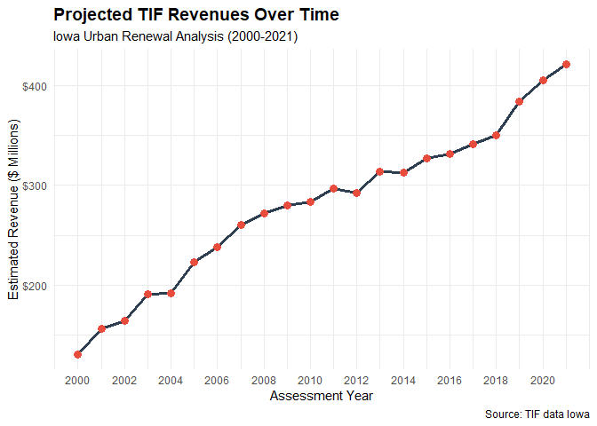
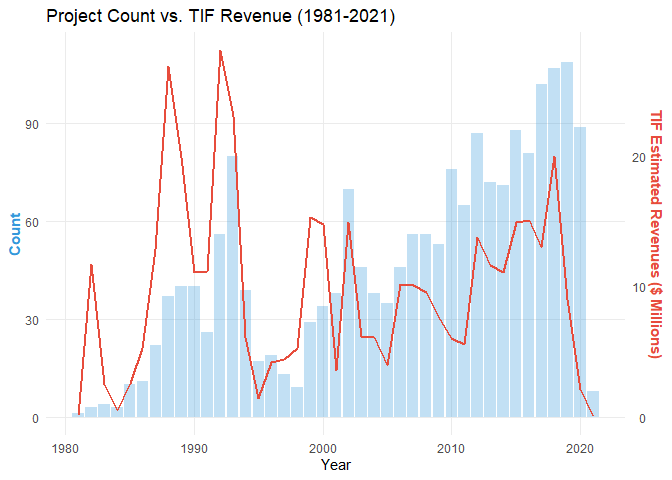
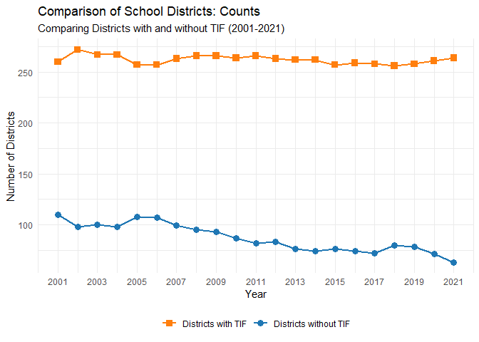
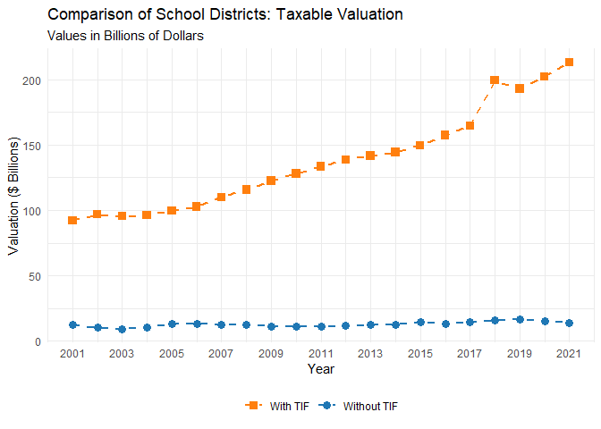

Here, I am using creating csv data file for the Tax increament finance
(TIF)

``` r
# Load the correct library for Excel files
library(readxl)

# Use read_excel instead of read_csv for .xlsx files
TIF_data_Iowa <- read_excel("C:/Users/vaish/Downloads/TIF data Iowa.xlsx")
```

    ## New names:
    ## • `` -> `...1`
    ## • `` -> `...2`

``` r
# Now it should show the data table as separate page
View(TIF_data_Iowa)


summary(TIF_data_Iowa)
```

    ##      ...1               ...2           Frozen Base Valuation ($ Millions)
    ##  Length:23          Length:23          Min.   : 6601                     
    ##  Class :character   Class :character   1st Qu.: 7544                     
    ##  Mode  :character   Mode  :character   Median : 8770                     
    ##                                        Mean   : 9124                     
    ##                                        3rd Qu.:10226                     
    ##                                        Max.   :12820                     
    ##                                        NA's   :1                         
    ##  Increment Valuation ($ Millions) Estimated TIF Revenues ($ Millions)
    ##  Min.   : 4463                    Min.   :130.3                      
    ##  1st Qu.: 6970                    1st Qu.:226.6                      
    ##  Median : 8949                    Median :287.5                      
    ##  Mean   : 9116                    Mean   :280.1                      
    ##  3rd Qu.:10972                    3rd Qu.:329.9                      
    ##  Max.   :14691                    Max.   :421.1                      
    ##  NA's   :1                        NA's   :1                          
    ##  Estimated TIF Revenues % Change Over Previous Year
    ##  Min.   :-0.017                                    
    ##  1st Qu.: 0.025                                    
    ##  Median : 0.043                                    
    ##  Mean   : 0.053                                    
    ##  3rd Qu.: 0.068                                    
    ##  Max.   : 0.167                                    
    ##  NA's   :2                                         
    ##  Estimated TIF Revenues Per Capita
    ##  Min.   : 44.49                   
    ##  1st Qu.: 76.30                   
    ##  Median : 93.84                   
    ##  Mean   : 91.06                   
    ##  3rd Qu.:105.39                   
    ##  Max.   :131.70                   
    ##  NA's   :1

``` r
#colnames(TIF_data_Iowa)

#names(TIF_data_Iowa)

#dim(TIF_data_Iowa)

#head(TIF_data_Iowa)

#glimpse(TIF_data_Iowa)
```

here I have made graph for Assessment Year, Estimated Revenue (\$
Millions) which can readable and understandable.

``` r
final_plot_data <- TIF_data_Iowa %>%
  filter(!is.na(...1))

ggplot(final_plot_data,
       aes(x = as.numeric(...1),
           y = `Estimated TIF Revenues ($ Millions)`)) +
  geom_line(color = "#2c3e50", linewidth = 1.2) +
  geom_point(color = "#e74c3c", size = 3) +
  theme_minimal() +
  scale_y_continuous(labels = label_dollar()) +
  scale_x_continuous(breaks = seq(2000, 2021, by = 2)) +
  labs(
    title = "Projected TIF Revenues Over Time",
    subtitle = "Iowa Urban Renewal Analysis (2000-2021)",
    x = "Assessment Year",
    y = "Estimated Revenue ($ Millions)",
    caption = "Source: TIF data Iowa"
  ) +
  theme(plot.title = element_text(face = "bold", size = 14))
```

    ## Warning in FUN(X[[i]], ...): NAs introduced by coercion
    ## Warning in FUN(X[[i]], ...): NAs introduced by coercion

    ## Warning: Removed 1 row containing missing values or values outside the scale range
    ## (`geom_line()`).

    ## Warning: Removed 1 row containing missing values or values outside the scale range
    ## (`geom_point()`).

<!-- -->

## Based on Years

I have created a table so that I can understand the table and we can
make graphs based the given table.

``` r
# Load the tidyverse library for data manipulation and clean tables
library(tidyverse)

# Create the data frame based on the provided images
tif_table <- tibble(
  Base_Year = c(
    "1981", "1982", "1983", "1984", "1985", "1986", "1987", "1988", "1989", "1990",
    "1991", "1992", "1993", "1994", "1995", "1996", "1997", "1998", "1999", "2000",
    "2001", "2002", "2003", "2004", "2005", "2006", "2007", "2008", "2009", "2010",
    "2011", "2012", "2013", "2014", "2015", "2016", "2017", "2018", "2019", "2020*", "2021*"
  ),
  Count = c(
    1, 3, 4, 3, 10, 11, 22, 37, 40, 40, 26, 56, 80, 39, 17, 19, 13, 9, 29, 34,
    38, 70, 46, 38, 35, 46, 56, 56, 53, 76, 65, 87, 72, 71, 88, 81, 102, 107, 109, 89, 8
  ),
  Frozen_Base_Valuation_Millions = c(
    1.80, 123.00, 42.40, 20.20, 57.30, 40.90, 258.80, 446.60, 271.20, 327.70,
    162.40, 489.60, 532.50, 213.30, 53.40, 213.80, 100.30, 173.10, 803.20, 215.90,
    96.30, 577.00, 191.50, 297.60, 158.10, 390.80, 339.50, 146.20, 394.70, 654.40,
    536.50, 147.80, 209.10, 504.10, 449.90, 1228.80, 629.50, 405.60, 127.00, 216.70, 52.30
  ),
  Incremental_Valuation_Millions = c(
    3.60, 311.30, 81.00, 20.50, 81.30, 165.70, 407.80, 913.10, 684.50, 388.90,
    384.90, 884.80, 801.30, 213.60, 48.30, 172.60, 154.90, 160.50, 492.20, 491.10,
    136.40, 518.10, 227.60, 204.10, 138.00, 393.50, 379.20, 440.40, 308.90, 243.10,
    190.80, 526.20, 432.30, 366.00, 518.40, 510.70, 531.30, 756.90, 364.60, 131.90, 2.40
  ),
  TIF_Estimated_Revenues_Millions = c(
    0.10, 11.70, 2.50, 0.50, 2.60, 5.30, 12.90, 26.90, 19.90, 11.10,
    11.20, 28.10, 23.10, 6.10, 1.40, 4.20, 4.40, 5.30, 15.30, 14.80,
    3.60, 14.90, 6.20, 6.10, 4.00, 10.20, 10.10, 9.60, 7.70, 6.00,
    5.60, 13.80, 11.60, 11.10, 14.90, 15.10, 13.00, 20.00, 9.00, 2.10, 0.02
  )
)

# View the table
print(tif_table)
```

    ## # A tibble: 41 × 5
    ##    Base_Year Count Frozen_Base_Valuation_Millions Incremental_Valuation_Millions
    ##    <chr>     <dbl>                          <dbl>                          <dbl>
    ##  1 1981          1                            1.8                            3.6
    ##  2 1982          3                          123                            311. 
    ##  3 1983          4                           42.4                           81  
    ##  4 1984          3                           20.2                           20.5
    ##  5 1985         10                           57.3                           81.3
    ##  6 1986         11                           40.9                          166. 
    ##  7 1987         22                          259.                           408. 
    ##  8 1988         37                          447.                           913. 
    ##  9 1989         40                          271.                           684. 
    ## 10 1990         40                          328.                           389. 
    ## # ℹ 31 more rows
    ## # ℹ 1 more variable: TIF_Estimated_Revenues_Millions <dbl>

``` r
# Optional: View as an interactive spreadsheet in RStudio
#View(tif_table)
```

can you create the base year graph by compare with each year.

``` r
# Load necessary libraries
library(ggplot2)
library(dplyr)
```

The above graph is count and TIF Estimated Revenues (\$ Millions) with
bar graph.

``` r
# 1. Prepare the dataset (Data sourced from provided tables)
tif_data <- data.frame(
  Year = 1981:2021,
  Count = c(1, 3, 4, 3, 10, 11, 22, 37, 40, 40, 26, 56, 80, 39, 17, 19, 13, 9, 29, 34, 
            38, 70, 46, 38, 35, 46, 56, 56, 53, 76, 65, 87, 72, 71, 88, 81, 102, 107, 109, 89, 8),
  Revenue = c(0.1, 11.7, 2.5, 0.5, 2.6, 5.3, 12.9, 26.9, 19.9, 11.1, 11.2, 28.1, 23.1, 6.1, 1.4, 
              4.2, 4.4, 5.3, 15.3, 14.8, 3.6, 14.9, 6.2, 6.1, 4.0, 10.2, 10.1, 9.6, 7.7, 6.0, 
              5.6, 13.8, 11.6, 11.1, 14.9, 15.1, 13.0, 20.0, 9.0, 2.1, 0.02)
)

# 2. Define the scaling factor for the second axis
# Since Count goes up to ~110 and Revenue to ~30, we multiply Revenue by 4 to align them
scale_factor <- 4

# 3. Create the Dual-Axis Visualization
ggplot(tif_data, aes(x = Year)) +
  # Bar chart for Project Count (Primary Axis)
  geom_bar(aes(y = Count), stat = "identity", fill = "#3498db", alpha = 0.3) +
  # Line chart for TIF Revenue (Scaled to fit the Primary Axis)
  geom_line(aes(y = Revenue * scale_factor), color = "#e74c3c", size = 1) +
  # Formatting the axes
  scale_y_continuous(
    name = "Count",
    sec.axis = sec_axis(~./scale_factor, name = "TIF Estimated Revenues ($ Millions)")
  ) +
  theme_minimal() +
  labs(
    title = "Project Count vs. TIF Revenue (1981-2021)",
    x = "Year"
  ) +
  theme(
    axis.title.y = element_text(color = "#3498db", face = "bold"),
    axis.title.y.right = element_text(color = "#e74c3c", face = "bold"),
    panel.grid.minor = element_blank()
  )
```

    ## Warning: Using `size` aesthetic for lines was deprecated in ggplot2 3.4.0.
    ## ℹ Please use `linewidth` instead.
    ## This warning is displayed once every 8 hours.
    ## Call `lifecycle::last_lifecycle_warnings()` to see where this warning was
    ## generated.

<!-- -->

## School Districts with TIF

``` r
# Create the school district dataset
tif_data <- data.frame(
  Assessment_Year = 2001:2021,
  
  # School Districts without TIF
  Count_No_TIF = c(110, 98, 100, 98, 108, 107, 99, 95, 93, 87, 82, 83, 76, 74, 76, 74, 72, 80, 78, 71, 63),
  Valuation_No_TIF_Millions = c(12230.0, 10140.5, 9240.4, 10610.0, 12885.7, 12894.7, 12451.2, 12667.7, 11264.4, 11232.0, 
                                11293.6, 11682.8, 12261.5, 12796.5, 14646.2, 13175.6, 14589.7, 16036.0, 16680.3, 15456.7, 14186.8),
  
  # School Districts with TIF
  Count_With_TIF = c(260, 272, 267, 267, 257, 257, 263, 266, 266, 264, 266, 263, 262, 262, 257, 259, 258, 256, 258, 261, 264),
  TIF_Specific_Valuation_Millions = c(5227.3, 5353.6, 5988.2, 5950.1, 6864.5, 7287.9, 7987.0, 8352.0, 8493.9, 8669.5, 
                                      9228.7, 9512.1, 10272.3, 10275.0, 10830.2, 11019.2, 11398.9, 11740.0, 12967.1, 13882.5, 14663.0),
  Total_Valuation_With_TIF_Districts = c(92202.8, 96859.1, 95417.4, 96126.9, 99694.4, 102601.9, 110052.2, 115806.9, 122624.4, 128146.7, 
                                         133436.3, 138700.7, 141823.3, 144536.4, 149721.7, 157557.9, 164681.6, 199418.7, 193060.6, 202224.4, 213226.5),
  
  # Aggregate Totals
  Total_Revenues_Millions = c(1219.9, 1264.7, 1289.3, 1323.3, 1394.2, 1443.5, 1530.2, 1621.9, 1754.4, 1803.0, 
                              1787.1, 1679.2, 1679.8, 1709.1, 1774.6, 1836.8, 1899.8, 2081.2, 2150.5, 2187.3, 2218.7)
)

# --- COMMAND TO VIEW IN RSTUDIO ---
view(tif_data)
```

``` r
# Load libraries
library(ggplot2)
library(dplyr)

# 1. Prepare Data
data <- data.frame(
  Year = 2001:2021,
  Count_No_TIF = c(110, 98, 100, 98, 108, 107, 99, 95, 93, 87, 82, 83, 76, 74, 76, 74, 72, 80, 78, 71, 63),
  Count_With_TIF = c(260, 272, 267, 267, 257, 257, 263, 266, 266, 264, 266, 263, 262, 262, 257, 259, 258, 256, 258, 261, 264),
  Val_No_TIF = c(12230.0, 10140.5, 9240.4, 10610.0, 12885.7, 12894.7, 12451.2, 12667.7, 11264.4, 11232.0, 
                 11293.6, 11682.8, 12261.5, 12796.5, 14646.2, 13175.6, 14589.7, 16036.0, 16680.3, 15456.7, 14186.8),
  Val_With_TIF = c(92202.8, 96859.1, 95417.4, 96126.9, 99694.4, 102601.9, 110052.2, 115806.9, 122624.4, 128146.7, 
                   133436.3, 138700.7, 141823.3, 144536.4, 149721.7, 157557.9, 164681.6, 199418.7, 193060.6, 202224.4, 213226.5)
) %>%
  mutate(Val_No_TIF_B = Val_No_TIF / 1000,
         Val_With_TIF_B = Val_With_TIF / 1000)

# --- GRAPH P1: DISTRICT COUNTS ---
p1 <- ggplot(data) +
  geom_line(aes(x = Year, y = Count_No_TIF, color = "Districts without TIF"), linewidth = 1) +
  geom_point(aes(x = Year, y = Count_No_TIF, color = "Districts without TIF"), shape = 16, size = 3) +
  geom_line(aes(x = Year, y = Count_With_TIF, color = "Districts with TIF"), linewidth = 1) +
  geom_point(aes(x = Year, y = Count_With_TIF, color = "Districts with TIF"), shape = 15, size = 3) +
  scale_color_manual(values = c("Districts without TIF" = "#1f77b4", "Districts with TIF" = "#ff7f0e")) +
  scale_x_continuous(breaks = seq(2001, 2021, 2)) +
  labs(title = "Comparison of School Districts: Counts",
       subtitle = "Comparing Districts with and without TIF (2001-2021)",
       x = "Year", y = "Number of Districts") +
  theme_minimal() +
  theme(legend.position = "bottom", legend.title = element_blank())

# View them as graph below
print(p1)
```

<!-- -->

``` r
# --- GRAPH P2: TAXABLE VALUATION ---
p2 <- ggplot(data) +
  geom_line(aes(x = Year, y = Val_No_TIF_B, color = "Without TIF"), linetype = "dashed", linewidth = 1) +
  geom_point(aes(x = Year, y = Val_No_TIF_B, color = "Without TIF"), shape = 16, size = 3) +
  geom_line(aes(x = Year, y = Val_With_TIF_B, color = "With TIF"), linetype = "dashed", linewidth = 1) +
  geom_point(aes(x = Year, y = Val_With_TIF_B, color = "With TIF"), shape = 15, size = 3) +
  scale_color_manual(values = c("Without TIF" = "#1f77b4", "With TIF" = "#ff7f0e")) +
  scale_x_continuous(breaks = seq(2001, 2021, 2)) +
  labs(title = "Comparison of School Districts: Taxable Valuation",
       subtitle = "Values in Billions of Dollars",
       x = "Year", y = "Valuation ($ Billions)") +
  theme_minimal() +
  theme(legend.position = "bottom", legend.title = element_blank())

# View them as graph below
print(p2)
```

<!-- -->
